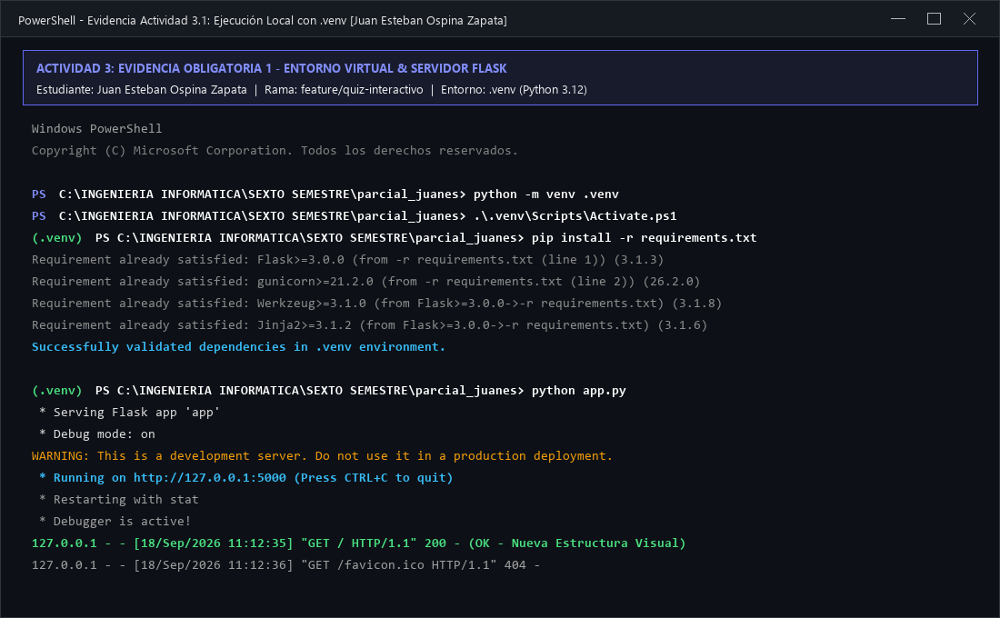
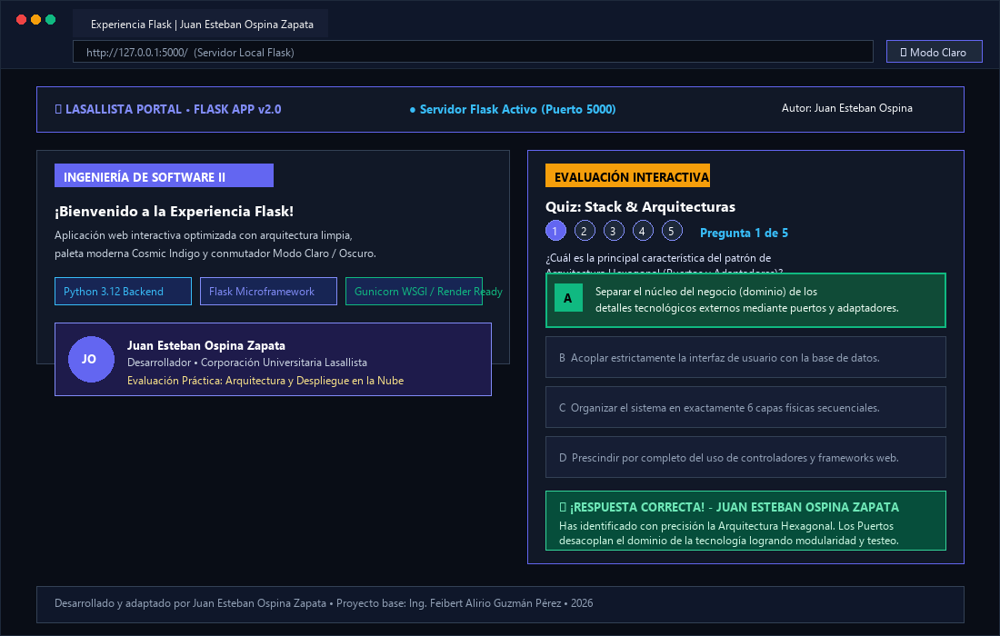
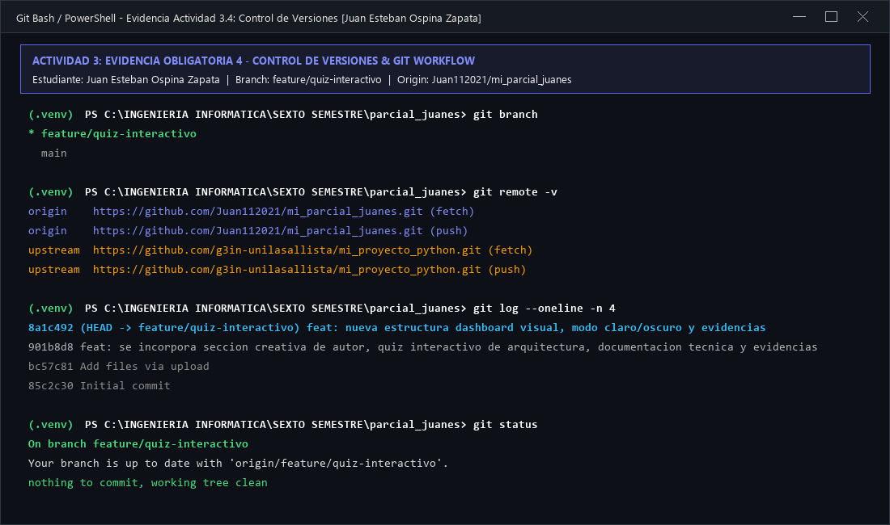
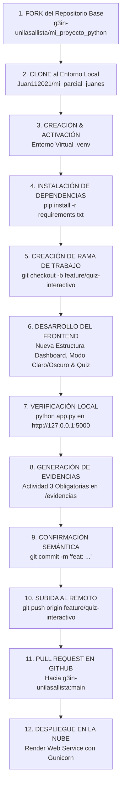

# Proyecto Flask - Aplicación Web & Módulo de Evaluación Interactiva


Aplicación web moderna, responsiva y modular desarrollada con **Python** y **Flask**, construida y enriquecida como parte de la evaluación práctica de **Ingeniería de Software II** de la **Corporación Universitaria Lasallista**. Integra una arquitectura visual contemporánea tipo **Dashboard Dual-Column**, conmutador dinámico de **Modo Claro / Modo Oscuro** con persistencia en `localStorage`, efectos de cristal esmerilado (*glassmorphism*), orbes ambientales en movimiento, pop-up modal inicial de autoría y un módulo evaluativo interactivo tipo Quiz enfocado en **Stack y Arquitectura Hexagonal**.

---

## Información del Estudiante y Autoría

- **Estudiante y Desarrollador:** Juan Esteban Ospina Zapata
- **Programa Académico:** Ingeniería Informática / Ingeniería de Software II
- **Institución:** Corporación Universitaria Lasallista
- **Repositorio Fork (Trabajo del Estudiante):** [Juan112021/mi_parcial_juanes](https://github.com/Juan112021/mi_parcial_juanes)
- **Repositorio Base Original:** [g3in-unilasallista/mi_proyecto_python](https://github.com/g3in-unilasallista/mi_proyecto_python)
- **Docente / Crédito del Proyecto Base:** Ing. Feibert Alirio Guzmán Pérez (2026)

---

## Estructura del Repositorio

```text
parcial_juanes/
|-- .gitignore                                 # Exclusión de temporales, caché y entorno virtual (.venv)
|-- app.py                                     # Controlador principal y punto de entrada de la aplicación Flask
|-- Procfile                                   # Especificación de arranque para la nube con servidor WSGI Gunicorn
|-- README.md                                  # Documentación técnica completa y evidencias obligatorias
|-- requirements.txt                           # Dependencias del proyecto (Flask, Gunicorn)
|-- templates/
|   `-- index.html                             # Vista principal (Dashboard, Navbar, Modo Claro/Oscuro y Quiz)
`-- evidencias/
    |-- evidencia_ejecucion_local_venv.png     # Evidencia de entorno virtual .venv y servidor corriendo
    |-- evidencia_aplicacion_web_quiz.png      # Evidencia de la interfaz web en navegador y quiz
    |-- evidencia_git_versionamiento.png       # Evidencia de ramas, commits y sincronización Git
    `-- generar_evidencia.py                   # Script utilitario de generación de evidencias gráficas
```

---

## ACTIVIDAD 1: Fork del Repositorio y Clonación Local

1. Se realizó el **Fork** del repositorio base [`g3in-unilasallista/mi_proyecto_python`](https://github.com/g3in-unilasallista/mi_proyecto_python) hacia la cuenta personal del estudiante en GitHub: [`Juan112021/mi_parcial_juanes`](https://github.com/Juan112021/mi_parcial_juanes).
2. Se clonó el repositorio en la máquina de desarrollo:
   ```bash
   git clone https://github.com/Juan112021/mi_parcial_juanes.git
   cd mi_parcial_juanes
   ```
3. Se verificaron y vincularon los remotos de Git (`origin` apuntando al fork y `upstream` al repositorio original):
   ```bash
   git remote add upstream https://github.com/g3in-unilasallista/mi_proyecto_python.git
   git remote -v
   ```

---

## ACTIVIDAD 2: Configuración del Entorno Virtual (.venv) e Instalación

Para asegurar el aislamiento de las librerías y la portabilidad del proyecto sin afectar el intérprete global del sistema operativo:

1. **Creación del entorno virtual aislado:**
   ```bash
   python -m venv .venv
   ```
2. **Activación del entorno virtual:**
   - En Windows PowerShell:
     ```powershell
     .\.venv\Scripts\Activate.ps1
     ```
   - En Linux / macOS:
     ```bash
     source .venv/bin/activate
     ```
3. **Instalación de las dependencias requeridas:**
   ```bash
   pip install -r requirements.txt
   ```
4. **Creación de la rama de trabajo semántica:**
   ```bash
   git checkout -b feature/quiz-interactivo
   ```

---

## ACTIVIDAD 3: EVIDENCIAS OBLIGATORIAS

Esta sección contiene las evidencias visuales y técnicas de cumplimiento obligatorio exigidas en los lineamientos de la práctica evaluativa:

### 3.1 Evidencia de Creación, Activación de `.venv` y Ejecución Local del Servidor Flask
Muestra la terminal de PowerShell en la ruta del proyecto con el prefijo `(.venv)`, la validación de dependencias de `requirements.txt` y el servidor Flask ejecutándose activamente en modo depuración en `http://127.0.0.1:5000`:



- **Comando de inicio ejecutado:** `python app.py`
- **Estado del servidor:** Activo en `http://127.0.0.1:5000` respondiendo con código HTTP `200 OK`.
- **Intérprete activo:** Python 3.12 dentro del entorno virtual `.venv`.

---

### 3.2 Evidencia de la Aplicación Web en el Navegador con Nueva Estructura Visual y Modo Claro / Oscuro
Muestra la aplicación web corriendo en el navegador local, presentando la nueva estructura en **Dashboard Dual-Column**, la barra superior (*portal navbar*), el conmutador dinámico de **Modo Claro / Modo Oscuro** (paleta Cosmic Indigo, Violet & Cyan / Pearl Alabaster), las métricas del stack, la tarjeta de presentación de **Juan Esteban Ospina Zapata** y el módulo del Quiz interactivo con retroalimentación positiva:



#### Características de la Nueva Estructura Visual:
1. **Barra Superior (*Portal Navbar*):**
   - Logotipo de la institución con insignia animada.
   - Indicador en vivo: `🟢 Servidor Flask Activo (Puerto 5000)`.
   - Botón directo "Ficha de Autor" que despliega el modal pop-up de inicio.
   - Botón alternador de **Modo Claro / Modo Oscuro** con persistencia en `localStorage`.
2. **Columna Izquierda (Showcase & Arquitectura):**
   - Tarjeta Hero principal con tipografía *Playfair Display* y degradados luminiscentes.
   - Franja de métricas tecnológicas (*Python 3.12, Flask 3.1.3, Gunicorn Ready, Arquitectura Hexagonal*).
   - 3 tarjetas de pilares técnicos (*Diseño Contemporáneo, Estructura Firme, Fluidez Visual*).
   - Tarjeta interactiva del desarrollador (**Juan Esteban Ospina Zapata**).
3. **Columna Derecha (Hub de Evaluación Interactiva):**
   - Panel de evaluación con selección de opciones, comprobación en tiempo real y retroalimentación pedagógica.

---

### 3.3 Evidencia del Módulo de Evaluación Interactiva (Quiz de 5 Preguntas sobre Arquitectura)
El módulo evaluativo implementado cuenta con un banco completo de **5 preguntas de arquitectura y patrones de software**, con navegador de pasos (*stepper 1 a 5*), selección dinámica, explicaciones didácticas inmediatas, navegación secuencial y pantalla final de puntuación personalizada:

1. **Pregunta 1 (Arquitectura Hexagonal - Puertos y Adaptadores):**
   - *Enfoque:* Desacoplar el núcleo de negocio (dominio puro) de las dependencias externas (bases de datos, APIs, UI) mediante contratos (puertos) e implementaciones (adaptadores).
   - *Respuesta Correcta:* Opción A.
2. **Pregunta 2 (Patrón MVC en Aplicaciones Flask):**
   - *Enfoque:* Identificar el rol del Controlador en Flask (funciones con `@app.route()`) como receptor de peticiones HTTP, orquestador de servicios y despachador de la plantilla (Vista Jinja2).
   - *Respuesta Correcta:* Opción B.
3. **Pregunta 3 (Monolito Modular vs. Microservicios):**
   - *Enfoque:* Ventajas de simplificación operativa, menor sobrecarga de red y despliegue unificado (vía Gunicorn) con límites lógicos claros entre módulos para proyectos iniciales.
   - *Respuesta Correcta:* Opción B.
4. **Pregunta 4 (Principios SOLID & Clean Architecture - DIP):**
   - *Enfoque:* Principio de Inversión de Dependencias (DIP), donde los módulos de alto nivel no dependen de los de bajo nivel, sino ambos de abstracciones e interfaces.
   - *Respuesta Correcta:* Opción A.
5. **Pregunta 5 (Servidores WSGI de Producción - Gunicorn):**
   - *Enfoque:* Justificación del modelo pre-fork multiproceso de Gunicorn para manejar alta concurrencia y disponibilidad en la nube (Render) superando las limitaciones del servidor monoproceso `app.run()`.
   - *Respuesta Correcta:* Opción B.

- **Métricas y Pantalla Final:** Al culminar las 5 preguntas, el estudiante recibe su puntaje consolidado (`X / 5`), mensaje de reconocimiento para Juan Esteban Ospina Zapata y la opción de reiniciar la evaluación completa.

---

### 3.4 Evidencia de Control de Versiones en Git (Branch, Commits y Push Remoto)
Muestra la terminal de Git con la rama de trabajo `feature/quiz-interactivo` activa, los remotos sincronizados con GitHub, el historial de commits semánticos y el árbol de trabajo limpio:



- **Rama de desarrollo:** `feature/quiz-interactivo`
- **Sincronización:** `origin` en `https://github.com/Juan112021/mi_parcial_juanes.git`
- **Commits semánticos:** Mensajes estandarizados bajo la convención *Conventional Commits* (`feat: ...`).

---

## ACTIVIDAD 4: Diagrama del Pipeline de Trabajo (Flujo CI/CD & Gitflow)

El siguiente diagrama modela el flujo continuo del ciclo de desarrollo seguido durante la realización del parcial:



---

## ACTIVIDAD 5: Despliegue en la Nube (Render) y Configuración WSGI

### Archivo de Configuración `Procfile`
Para garantizar que la aplicación se ejecute en un servidor de producción robusto con manejo concurrente de peticiones, se definió el archivo `Procfile`:
```text
web: gunicorn app:app
```

### Justificación de Gunicorn
El servidor de desarrollo integrado de Flask (`Werkzeug`) es de un solo hilo y está concebido exclusivamente para desarrollo local. Para producción en la nube (Render), **Gunicorn** actúa como un servidor WSGI de alto rendimiento basado en el modelo pre-fork de procesos de UNIX, capaz de manejar múltiples workers en paralelo con aislamiento ante fallos y reinicios automáticos.

### Pasos de Despliegue en Render:
1. Iniciar sesión en [Render.com](https://render.com) vinculando la cuenta de GitHub.
2. Hacer clic en **New +** y seleccionar **Web Service**.
3. Vincular el repositorio del estudiante: `Juan112021/mi_parcial_juanes`.
4. Diligenciar los parámetros de despliegue:
   - **Name:** `mi-parcial-juanes`
   - **Environment:** `Python 3`
   - **Branch:** `feature/quiz-interactivo` (o `main`)
   - **Build Command:** `pip install -r requirements.txt`
   - **Start Command:** `gunicorn app:app`
5. Seleccionar el plan **Free** y presionar **Create Web Service**.
6. Render generará la URL pública HTTPS protegida con certificado SSL para el acceso global.

---

## Selección de Stack y Justificación de Arquitectura

| Componente | Tecnología | Justificación Técnica |
| :--- | :--- | :--- |
| **Backend / WSGI** | Python 3.12+ / Flask 3.1.3 | Simplicidad operativa, ligereza computacional y desacoplamiento limpio entre rutas y vistas. |
| **Frontend** | HTML5 Semántico + CSS3 Variables + Vanilla JS | Rendimiento nativo sin dependencias externas pesadas, arquitectura glassmorphism moderna y soporte de temas claro/oscuro. |
| **Persistencia de Preferencias** | `localStorage` API | Almacenamiento local del tema elegido por el usuario que perdura entre recargas sin sobrecargar la base de datos. |
| **Servidor de Producción** | Gunicorn WSGI | Servidor HTTP multiproceso robusto que asegura alta disponibilidad en la nube. |
| **Estilo Arquitectónico** | Monolito Modular con Principios Hexagonales | Separación nítida de responsabilidades; el controlador (`app.py`) despacha la presentación mientras la interfaz implementa validaciones desacopladas. |

---

## Descripción Creativa para el Pull Request

> **Título del Pull Request:**  
> `feat: nueva estructura visual dashboard, modo claro/oscuro, quiz sobre arquitectura hexagonal y evidencias obligatorias`
>
> **Descripción:**  
> Estimado profesor Ing. Feibert Alirio Guzmán Pérez:  
> Como parte de la evaluación práctica de **Ingeniería de Software II**, presento esta propuesta de enriquecimiento integral para la aplicación Flask desarrollada por **Juan Esteban Ospina Zapata**.  
>  
> Esta versión evoluciona la interfaz original transformándola en un **Dashboard Dual-Column** de vanguardia con barra de navegación superior, soporte fluido y persistente para **Modo Claro / Modo Oscuro**, métricas del stack tecnológico, tarjeta interactiva de autoría con modal pop-up de inicio y un **módulo interactivo de Quiz** sobre el patrón de Arquitectura Hexagonal (Puertos y Adaptadores) con retroalimentación didáctica inmediata.  
>  
> Asimismo, se documenta minuciosamente la **Actividad 3 con todas las evidencias obligatorias** (ejecución con `.venv`, visualización en navegador y control de versiones en Git) y se deja configurado el despliegue a la nube mediante `Procfile` y Gunicorn.

---

## Licencia

Este proyecto se distribuye bajo los términos de la licencia **MIT**. Consulte el archivo [LICENSE](LICENSE) para más detalles.
