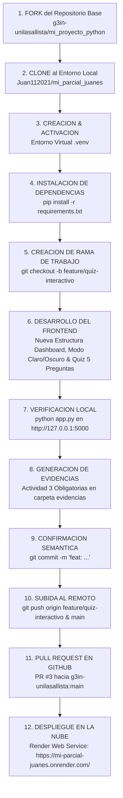

# Proyecto Flask - Aplicacion Web & Modulo de Evaluacion Interactiva


Aplicacion web moderna, responsiva y modular desarrollada con **Python** y **Flask**, construida y enriquecida como parte de la evaluacion practica de **Ingenieria de Software II** de la **Corporacion Universitaria Lasallista**. Integra una arquitectura visual contemporanea tipo **Dashboard Dual-Column**, conmutador dinamico de **Modo Claro / Modo Oscuro** con persistencia en `localStorage`, efectos de cristal esmerilado (*glassmorphism*), orbes ambientales en movimiento, ventana modal inicial de autoria y un modulo evaluativo interactivo de 5 preguntas sobre **Stack Tecnologico y Arquitectura Hexagonal**.

---

## Enlaces Oficiales de la Entrega

| Recurso / Entrega | Descripcion | Enlace Directo |
| :--- | :--- | :--- |
| **Despliegue en la Nube (Render)** | Aplicacion web en vivo con certificado SSL | [https://mi-parcial-juanes.onrender.com/](https://mi-parcial-juanes.onrender.com/) |
| **Repositorio Personal (GitHub Fork)** | Codigo fuente completo y ramas de trabajo | [https://github.com/Juan112021/mi_parcial_juanes](https://github.com/Juan112021/mi_parcial_juanes) |
| **Pull Request Oficial de Entrega** | Solicitud de incorporacion **PR #3** en el repositorio base | [https://github.com/g3in-unilasallista/mi_proyecto_python/pull/3](https://github.com/g3in-unilasallista/mi_proyecto_python/pull/3) |
| **Repositorio Base Original** | Repositorio institucional de la asignatura | [https://github.com/g3in-unilasallista/mi_proyecto_python](https://github.com/g3in-unilasallista/mi_proyecto_python) |

> [!NOTE]
> La aplicacion desplegada en Render sincroniza de forma continua con la rama `main` del repositorio `Juan112021/mi_parcial_juanes`, asegurando que cualquier actualizacion se refleje de manera inmediata en produccion.

---

## Informacion del Estudiante y Autoria

- **Estudiante y Desarrollador:** Juan Esteban Ospina Zapata
- **Programa Academico:** Ingenieria Informatica / Ingenieria de Software II
- **Institucion:** Corporacion Universitaria Lasallista
- **Repositorio Fork:** [Juan112021/mi_parcial_juanes](https://github.com/Juan112021/mi_parcial_juanes)
- **Pull Request de Calificacion:** [PR #3 en g3in-unilasallista/mi_proyecto_python](https://github.com/g3in-unilasallista/mi_proyecto_python/pull/3)
- **URL en Produccion (Render):** [https://mi-parcial-juanes.onrender.com/](https://mi-parcial-juanes.onrender.com/)
- **Docente / Credito del Proyecto Base:** Ing. Feibert Alirio Guzman Perez (2026)

---

## Estructura del Repositorio

```text
parcial_juanes/
|-- .gitignore                                 # Exclusion de temporales, cache y entorno virtual (.venv)
|-- app.py                                     # Controlador principal y punto de entrada de la aplicacion Flask
|-- Procfile                                   # Especificacion de arranque para Render con servidor WSGI Gunicorn
|-- README.md                                  # Documentacion tecnica integral, enlaces y evidencias
|-- requirements.txt                           # Dependencias del proyecto (Flask, Gunicorn)
|-- subir_a_github.bat                         # Utilidad interactiva para sincronizacion Git
|-- templates/
|   `-- index.html                             # Vista principal (Dashboard, Navbar, Modo Claro/Oscuro y Quiz)
`-- evidencias/
    |-- evidencia_ejecucion_local_venv.png     # Evidencia de entorno virtual .venv y servidor corriendo
    |-- evidencia_aplicacion_web_quiz.png      # Evidencia de la interfaz web en navegador y quiz
    |-- evidencia_git_versionamiento.png       # Evidencia de ramas, commits y sincronizacion Git
    `-- generar_evidencia.py                   # Script utilitario de generacion de evidencias graficas
```

---

## ACTIVIDAD 1: Fork del Repositorio y Clonacion Local

1. Se realizo el **Fork** del repositorio base [`g3in-unilasallista/mi_proyecto_python`](https://github.com/g3in-unilasallista/mi_proyecto_python) hacia la cuenta personal del estudiante: [`Juan112021/mi_parcial_juanes`](https://github.com/Juan112021/mi_parcial_juanes).
2. Se clono el repositorio localmente para su desarrollo:
   ```bash
   git clone https://github.com/Juan112021/mi_parcial_juanes.git
   cd mi_parcial_juanes
   ```
3. Se vincularon los remotos de control de versiones (`origin` al fork personal y `upstream` al repositorio docente):
   ```bash
   git remote add upstream https://github.com/g3in-unilasallista/mi_proyecto_python.git
   git remote -v
   ```

---

## ACTIVIDAD 2: Configuracion del Entorno Virtual (.venv) e Instalacion

Para garantizar el aislamiento de paquetes sin alterar el interprete global del sistema operativo:

1. **Creacion del entorno virtual aislado:**
   ```bash
   python -m venv .venv
   ```
2. **Activacion del entorno virtual:**
   - En Windows PowerShell:
     ```powershell
     .\.venv\Scripts\Activate.ps1
     ```
   - En Linux / macOS:
     ```bash
     source .venv/bin/activate
     ```
3. **Instalacion de dependencias requeridas:**
   ```bash
   pip install -r requirements.txt
   ```
4. **Creacion de la rama de trabajo semantica:**
   ```bash
   git checkout -b feature/quiz-interactivo
   ```

---

## ACTIVIDAD 3: EVIDENCIAS OBLIGATORIAS

Esta seccion compila las evidencias visuales y tecnicas requeridas en los criterios de evaluacion de la practica:

### 3.1 Evidencia de Creacion, Activacion de `.venv` y Ejecucion Local del Servidor Flask
Captura de la terminal de PowerShell en la raiz del proyecto con el prefijo `(.venv)`, validacion de paquetes e inicio del servidor en modo depuracion:


- **Comando ejecutado:** `python app.py`
- **Estado del servidor:** Activo en `http://127.0.0.1:5000` con codigo HTTP `200 OK`.
- **Interprete:** Python 3.12 aislado en `.venv`.

---

### 3.2 Evidencia de la Aplicacion Web en el Navegador con Nueva Estructura Visual y Modo Claro / Oscuro
Captura de la aplicacion en ejecucion local mostrando la nueva arquitectura visual tipo **Dashboard Dual-Column**, barra superior (*portal navbar*), conmutador de **Modo Claro / Modo Oscuro**, franja de metricas, identificacion de **Juan Esteban Ospina Zapata** y modulo evaluativo:


#### Componentes de la Nueva Estructura:
1. **Barra Superior (*Portal Navbar*):**
   - Logotipo institucional con insignia interactiva.
   - Indicador de estado: `Servidor Flask Activo (Puerto 5000)`.
   - Acceso rapido a Ficha de Autor (modal emergente).
   - Conmutador dinamico de Modo Claro y Modo Oscuro con persistencia en `localStorage`.
2. **Columna Izquierda (Showcase & Arquitectura):**
   - Tarjeta Hero con tipografia Playfair Display y degradados contemporaneos.
   - Franja de metricas tecnicas (Python 3.12+, Flask 3.1.3, Gunicorn Ready, Arquitectura Hexagonal).
   - 3 tarjetas de pilares tecnicos (Diseno Contemporaneo, Estructura Firme, Fluidez Visual).
   - Tarjeta interactiva del estudiante desarrollador (**Juan Esteban Ospina Zapata**).
3. **Columna Derecha (Hub de Evaluacion Interactiva):**
   - Panel de evaluacion de 5 preguntas con navegador de pasos, retroalimentacion didactica y pantalla final.

---

### 3.3 Evidencia del Modulo de Evaluacion Interactiva (Quiz de 5 Preguntas sobre Arquitectura)
El modulo evaluativo cuenta con un banco completo de **5 preguntas tecnicas sobre arquitectura de software**, con navegador secuencial (*stepper 1 a 5*), validacion instantanea, explicaciones teoricas y consolidacion de puntaje final:

1. **Pregunta 1 (Arquitectura Hexagonal - Puertos y Adaptadores):**
   - *Enfoque:* Desacoplar el dominio del negocio de dependencias externas (bases de datos, APIs) mediante contratos (puertos) e implementaciones (adaptadores).
   - *Respuesta Correcta:* Opcion A.
2. **Pregunta 2 (Patron MVC en Aplicaciones Flask):**
   - *Enfoque:* Funcion del Controlador en Flask (rutas con `@app.route()`) como receptor de peticiones HTTP, coordinador de logica y despachador de plantillas Jinja2.
   - *Respuesta Correcta:* Opcion B.
3. **Pregunta 3 (Monolito Modular vs. Microservicios):**
   - *Enfoque:* Ventajas de simplificacion operativa, menor latencia y despliegue unificado (via Gunicorn) manteniendo fronteras logicas limpias entre modulos.
   - *Respuesta Correcta:* Opcion B.
4. **Pregunta 4 (Principios SOLID & Clean Architecture - DIP):**
   - *Enfoque:* Principio de Inversion de Dependencias (DIP), donde los modulos de alto y bajo nivel dependen de abstracciones e interfaces.
   - *Respuesta Correcta:* Opcion A.
5. **Pregunta 5 (Servidores WSGI de Produccion - Gunicorn):**
   - *Enfoque:* Justificacion del modelo pre-fork multiproceso de Gunicorn para manejar alta concurrencia y disponibilidad en la nube (Render) superando el servidor monoproceso de desarrollo.
   - *Respuesta Correcta:* Opcion B.

- **Consolidacion y Puntaje:** Al completar las 5 preguntas se presenta la pantalla de resultados con el puntaje obtenido (`X / 5`), mensaje personalizado de reconocimiento a Juan Esteban Ospina Zapata y boton para reiniciar la evaluacion.

---

### 3.4 Evidencia de Control de Versiones en Git (Branch, Commits y Push Remoto)
Captura de la terminal de Git confirmando la rama `feature/quiz-interactivo`, historial de commits estandarizados y sincronizacion limpia hacia GitHub:


- **Rama de trabajo:** `feature/quiz-interactivo`
- **Sincronizacion remota:** `origin` en `https://github.com/Juan112021/mi_parcial_juanes.git`
- **Commits semanticos:** Bajo estandar Conventional Commits (`feat: ...`).

---

## ACTIVIDAD 4: Diagrama del Pipeline de Trabajo (Flujo CI/CD & Gitflow)

El siguiente esquema representa el ciclo completo de desarrollo y puesta en produccion:



---

## ACTIVIDAD 5: Despliegue en la Nube (Render) y Configuracion WSGI

### URL de Acceso en Vivo
- **Enlace de Produccion:** [https://mi-parcial-juanes.onrender.com/](https://mi-parcial-juanes.onrender.com/)

### Archivo de Configuracion `Procfile`
Para garantizar que la aplicacion se ejecute bajo un servidor WSGI de produccion con soporte para multiples peticiones concurrentes:
```text
web: gunicorn app:app
```

### Justificacion de Gunicorn
El servidor integrado de desarrollo de Flask (`Werkzeug`) es de un solo hilo y no cuenta con tolerancia a fallos ni balanceo de carga. **Gunicorn** actua como servidor HTTP WSGI basado en un modelo pre-fork de workers en UNIX, permitiendo atender multiples solicitudes simultaneas de manera eficiente, segura y escalable en la infraestructura de Render.

### Parametros de Configuracion en Render:
- **Service Type:** Web Service
- **Name:** `mi-parcial-juanes`
- **Region:** US West / Oregon (o predeterminada)
- **Branch:** `main`
- **Build Command:** `pip install -r requirements.txt`
- **Start Command:** `gunicorn app:app`
- **Instance Type:** Free ($0 / month)

---

## Estado del Pull Request Oficial

> [!IMPORTANT]
> El Pull Request formal de calificacion ya fue presentado ante el repositorio del docente:
> - **Numero de Pull Request:** [PR #3](https://github.com/g3in-unilasallista/mi_proyecto_python/pull/3)
> - **Titulo:** `Pull Juan Esteban Ospina`
> - **Repositorio Destino:** `g3in-unilasallista/mi_proyecto_python` (Rama `main`)
> - **Repositorio Origen:** `Juan112021/mi_parcial_juanes` (Rama `main` / `feature/quiz-interactivo`)
> - **Estado:** Abierto y listo para revision docente.

---

## Seleccion de Stack y Justificacion de Arquitectura

| Componente | Tecnologia | Justificacion Tecnica |
| :--- | :--- | :--- |
| **Backend / WSGI** | Python 3.12+ / Flask 3.1.3 | Simplicidad operativa, ejecucion ligera y separacion nítida entre rutas y vistas. |
| **Frontend** | HTML5 Semantico + CSS3 Variables + Vanilla JS | Maximo rendimiento nativo sin frameworks pesados, diseno glassmorphism y soporte de temas. |
| **Persistencia de Preferencias** | `localStorage` API | Almacenamiento local del tema seleccionado por el usuario entre recargas de pagina. |
| **Servidor de Produccion** | Gunicorn WSGI | Servidor concurrente multiproceso para alta disponibilidad en Render. |
| **Estilo Arquitectonico** | Monolito Modular con Principios Hexagonales | Organizacion desacoplada; el backend despacha la vista mientras la logica del cliente valida la evaluacion. |

---

## Licencia

Este proyecto se distribuye bajo los terminos de la licencia **MIT**. Consulte el archivo [LICENSE](LICENSE) para mas detalles.
